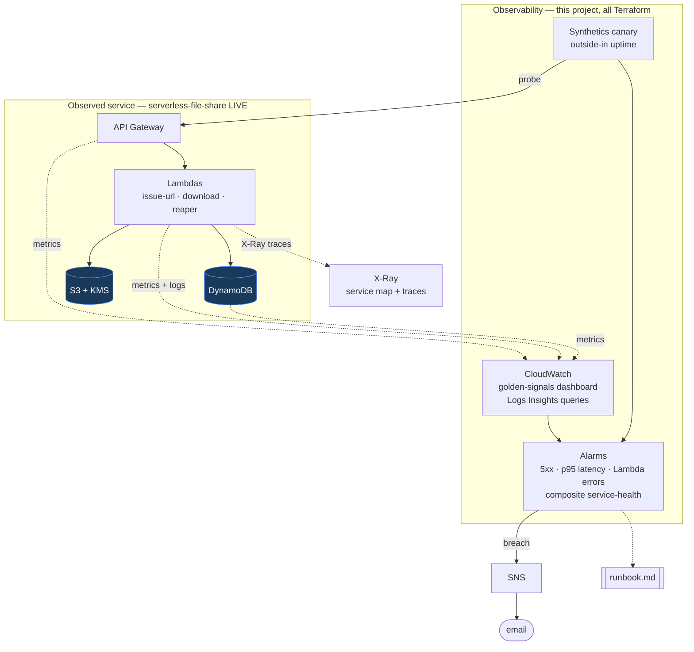

# Architecture

## The four golden signals, mapped

| Signal | Where |
|---|---|
| **Latency** | API p50/p95 + Lambda Duration p95 + DynamoDB latency |
| **Traffic** | API request count, Lambda invocations |
| **Errors** | API 4xx/5xx, Lambda errors, DynamoDB throttles |
| **Saturation** | Lambda throttles + concurrent executions |

## Flow

The live serverless stack emits metrics, logs, and X-Ray traces. This project (all Terraform) turns them into a **golden-signals dashboard**, **saved Logs Insights queries**, **SLO-backed alarms** (wired to SNS), and an **outside-in Synthetics canary** — with every alarm mapped to a step in the [runbook](runbook.md). The capstone is a rehearsed failure-injection drill ([stage5.md](stage5.md)).
